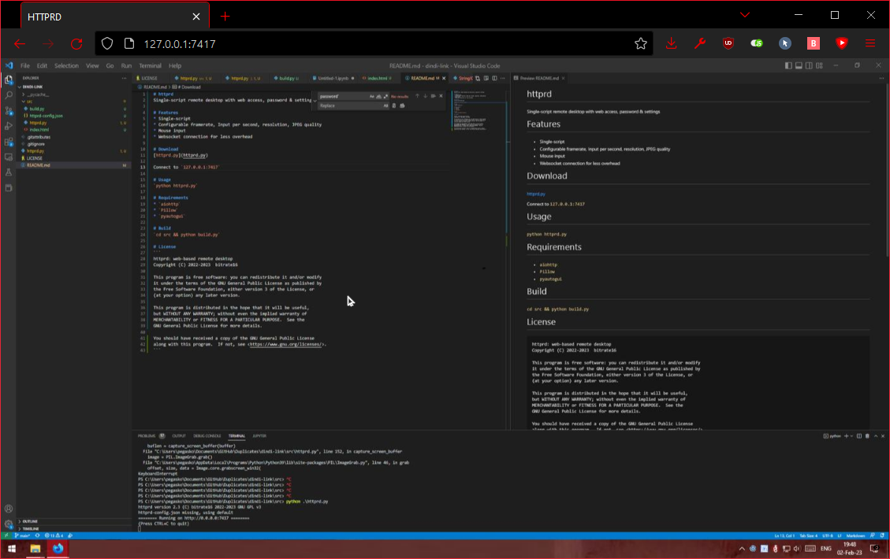

# httprd
Single-script remote desktop with web access, password & settings



# Features
* Single-script
* Configurable framerate, Input per second, resolution, JPEG quality
* Mouse & Keyboard input
* Websocket connection for less overhead

# Download
[httprd.py from release page](https://github.com/bitrate16/httprd/releases/latest)

Run `$ python httprd.py` & Connect to `127.0.0.1:7417`

# Usage

```
$ pip install -r requirements.txt
$ python httprd.py --port 12345 --password=qwerty --view_password=ytrewq
```

Arguments:
```
> python .\httprd.py -h
usage: httprd.py [-h] [--port {1..65535}] [--password PASSWORD] [--view_password VIEW_PASSWORD] [--fullscreen]

Process some integers.

optional arguments:
  -h, --help            show this help message and exit
  --port {1..65535}     server port
  --password PASSWORD   password for remote control session
  --view_password VIEW_PASSWORD
                        password for view only session (can only be set if --password is set)
  --fullscreen          enable multi-display screen capture
```

# Requirements
* `aiohttp`
* `Pillow`
* `pyautogui`

# Build (merge into one script)
`cd src && python build.py`

# License
```
httprd: web-based remote desktop
Copyright (C) 2022-2023  bitrate16

This program is free software: you can redistribute it and/or modify
it under the terms of the GNU General Public License as published by
the Free Software Foundation, either version 3 of the License, or
(at your option) any later version.

This program is distributed in the hope that it will be useful,
but WITHOUT ANY WARRANTY; without even the implied warranty of
MERCHANTABILITY or FITNESS FOR A PARTICULAR PURPOSE.  See the
GNU General Public License for more details.

You should have received a copy of the GNU General Public License
along with this program.  If not, see <https://www.gnu.org/licenses/>.
```

# Protocol overview

Packet structure:
* `packet_type` - type of the packet (8 bit)
* `payload` - type-dependent payload (varying size)

Send/Recv packets have the same structure.

## Frame request (client -> server)

* `packet_type` = `0x01`
* `payload`:
  * `viewport_width` - width of client viewport (16 bits)
  * `viewport_height` - height of client viewport (16 bits)
  * `quality` - JPEG compression quality (8 bits)

## Frame response (server -> client)

* `packet_type` = `0x02`
* `payload`:
  * `frame_type` - type of response frame:
  * `remote_width` - width of server viewport (16 bits)
  * `remote_height` - height of server viewport (16 bits)
  * `extra_payload` - depends on frame type:
    * `frame_type = 0x00` - empty frame, sent when no data has changed:
	  * **no data**
	* `frame_type = 0x01` - full frame, used for full repaint and/or initial frame
	  * JPEG image blob for full region
	* `frame_type = 0x02` - partial frame
	  * `crop_x` - crop x coordinate (from top-left) (16 bits)
	  * `crop_y` - crop y coordinate (from top-left) (16 bits)
	  * JPEG image blob for cropped region

> Info: empty frames and cropped frames can not be sent forever. If client receives too many cropped frames, image becomes unrecognizeable and content can not be displayed properly because of JPEG artifacts stacking. To solve this problem, full repaint is sent after each `MIN_PARTIAL_FRAMES_BEFORE_FULL_REPAINT` partial frames and after each `MIN_EMPTY_FRAMES_BEFORE_FULL_REPAINT` empty frames (if nothinbg change for a long time and image JPEGged after dragging mouse to improve image during still image).

## Input request (client -> server)

Ignored if user has connected as viewer

* `packet_type` = `0x03`
* `payload`:
  * `input_list` - ascii-encoded JSON with input info (**TODO: Convert to binary format**)

Input event types:

```
INPUT_EVENT_MOUSE_MOVE   = 0
INPUT_EVENT_MOUSE_DOWN   = 1
INPUT_EVENT_MOUSE_UP     = 2
INPUT_EVENT_MOUSE_SCROLL = 3
INPUT_EVENT_KEY_DOWN     = 4
INPUT_EVENT_KEY_UP       = 5
```

`input_list` depending on event type:
* `INPUT_EVENT_MOUSE_MOVE`
	* `[ mouse_x, mouse_y ]`
* `INPUT_EVENT_MOUSE_DOWN`
	* `[ mouse_x, mouse_y, button ]`
* `INPUT_EVENT_MOUSE_UP`
	* `[ mouse_x, mouse_y, button ]`
* `INPUT_EVENT_MOUSE_SCROLL`
	* `[ mouse_x, mouse_y, dy ]`
* `INPUT_EVENT_KEY_DOWN`
	* `[ keycode (pyautogui format) ]`
* `INPUT_EVENT_KEY_UP`
	* `[ keycode (pyautogui format) ]`

Input endpoint uses [pyautogui-compatible namings](https://pyautogui.readthedocs.io/en/latest/keyboard.html#keyboard-keys) for keys. Currently [javascript keys](https://developer.mozilla.org/en-US/docs/Web/API/UI_Events/Keyboard_event_code_values) are mapped into pyautogui on client-side.
